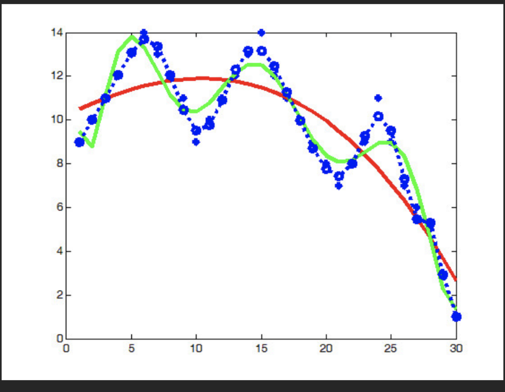
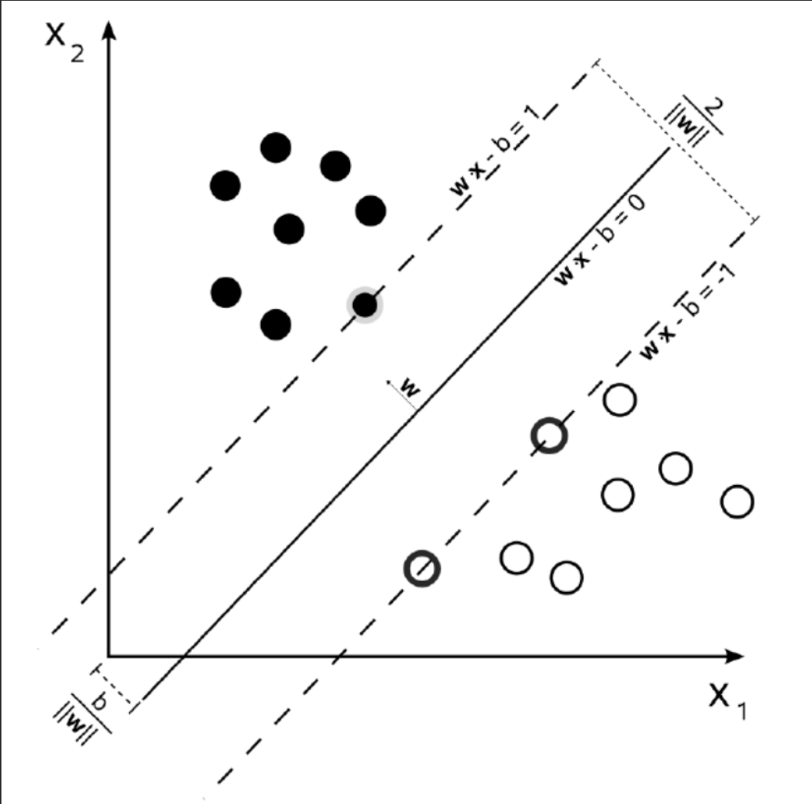
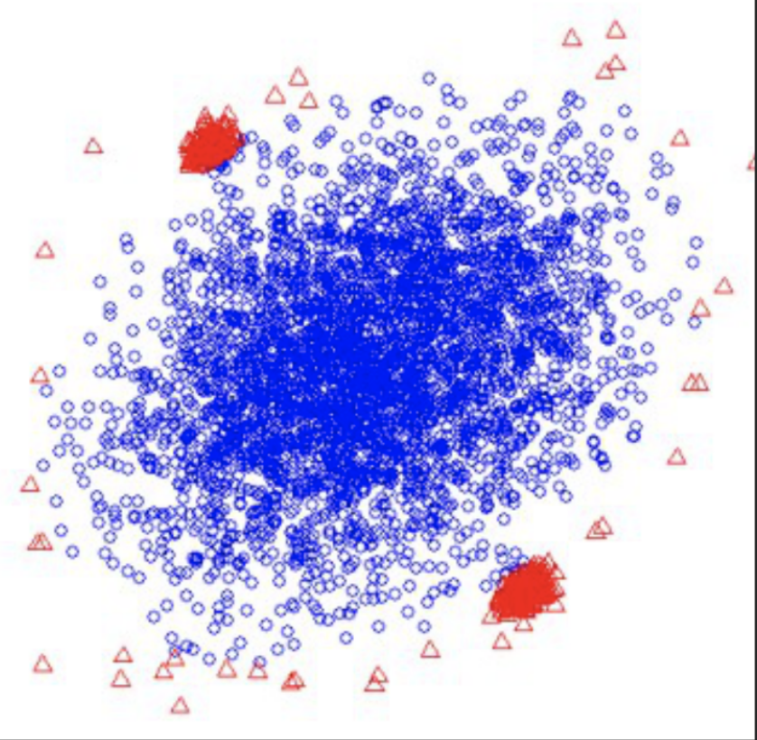
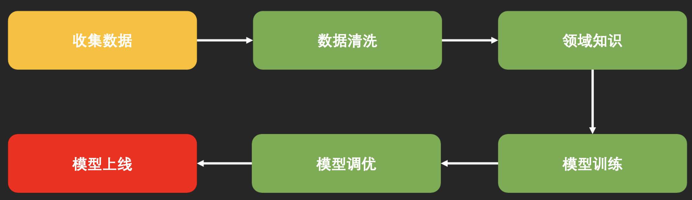

# 绪论

## 起源

大数据技术的出现

- 数据的涌现

    4V

    Volume（容量）

    Variety（多样性）

    Value（价值）

    Velocity（速度）

- 计算能力的提升

    CPU；GPU；异构计算；分布式计算

## 典型问题

### 拟合(Regression)

### 分类(Classification)

### 聚类(Clustering)

### 异常检测(Anomaly Detectioin)

## 基本流程

