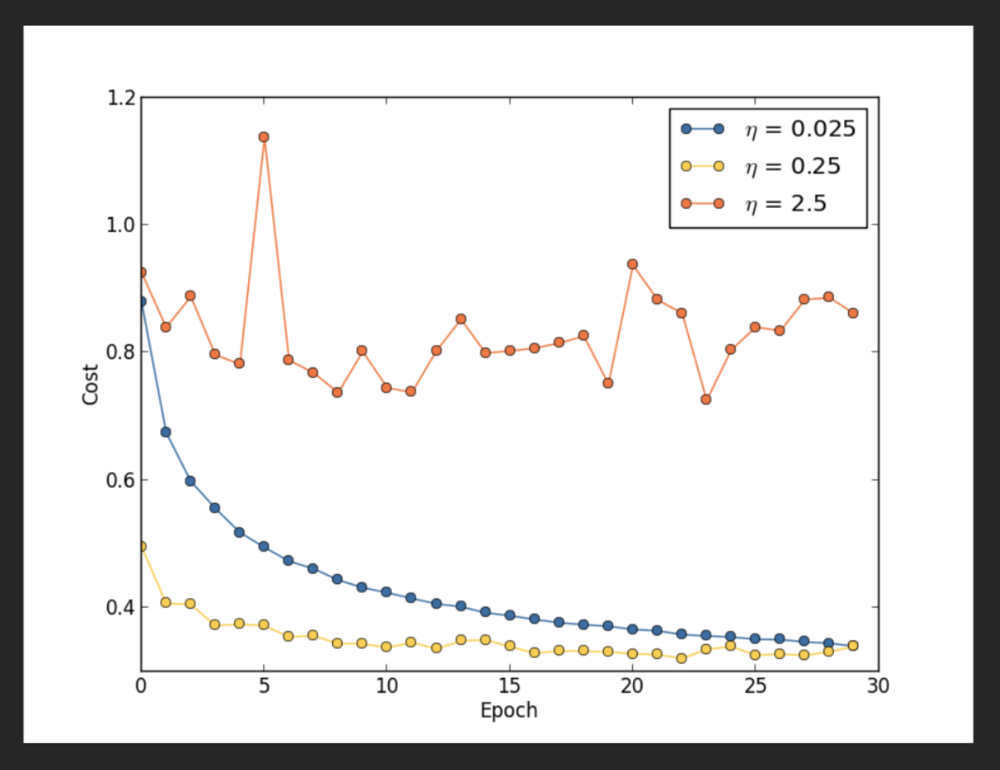

# 拟合和优化

## 拟合

不确定到确定的自然规律

- 人类知识的演化

    模糊-精确

    经验性-理论基础

- 数据的噪声掩盖了正解——不确定性

    大数据让我们从噪声中挖掘出统计规律，从而降低了不确定性

### 科学范式的转变

### 牛顿机与开普勒机

### 数学模型

为什么成本函数不在一次元

### 线行拟合的闭合解

## 优化

### 梯度下降

一阶梯度下降

对线性拟合问题有

### 牛顿法

二阶梯度下降

加入动量的梯度下降

加速收敛

###  学习速率

**学习速率的选择**

- 人工调节学习速率

    人工观察成本函数的变化（human intelligence）

- 可变的学习速率

    例如：every k iterations，set a = a * 0.9

- Early Stopping

    在正确的时间做正确的事情

