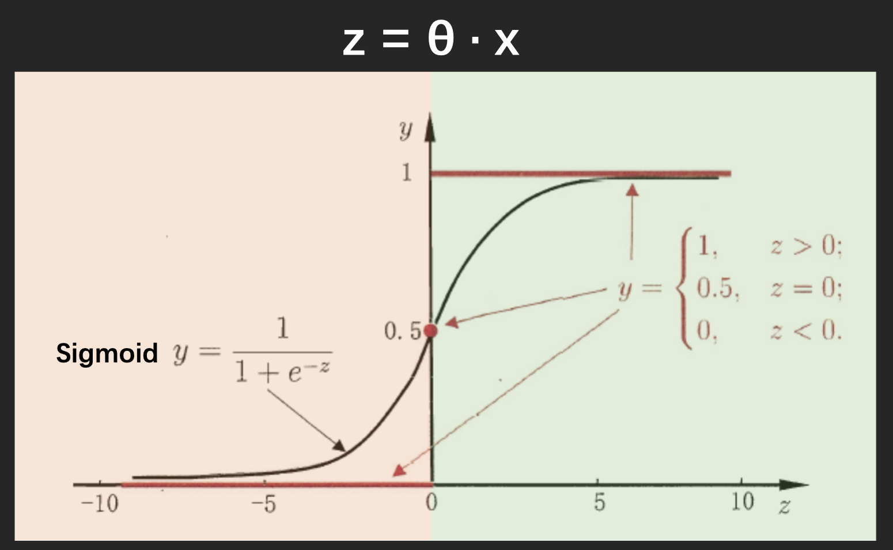
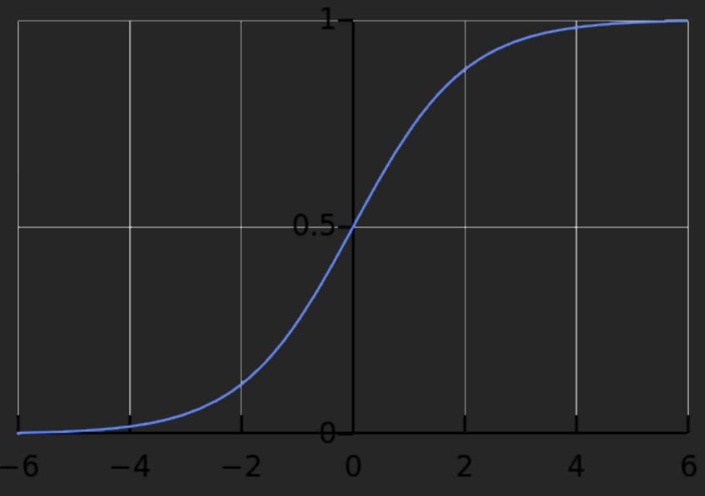
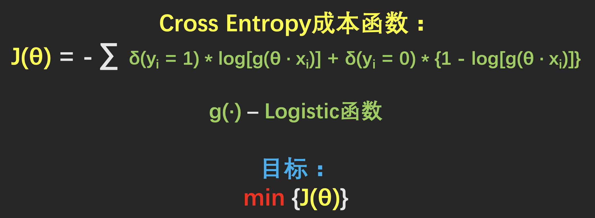
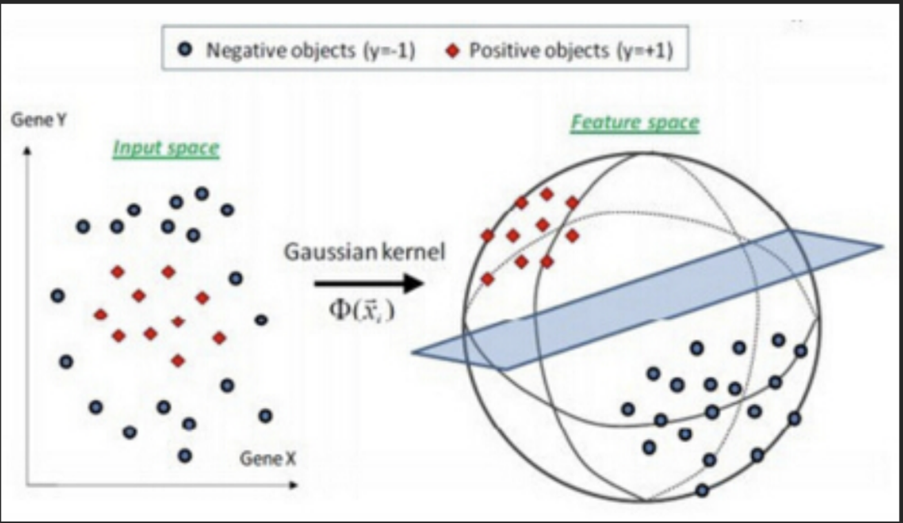
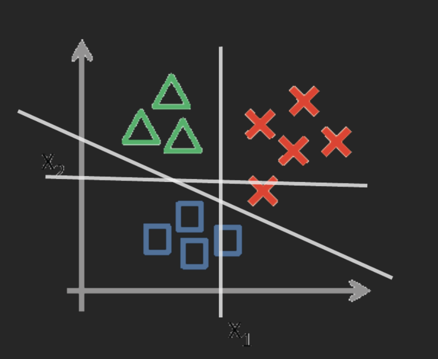
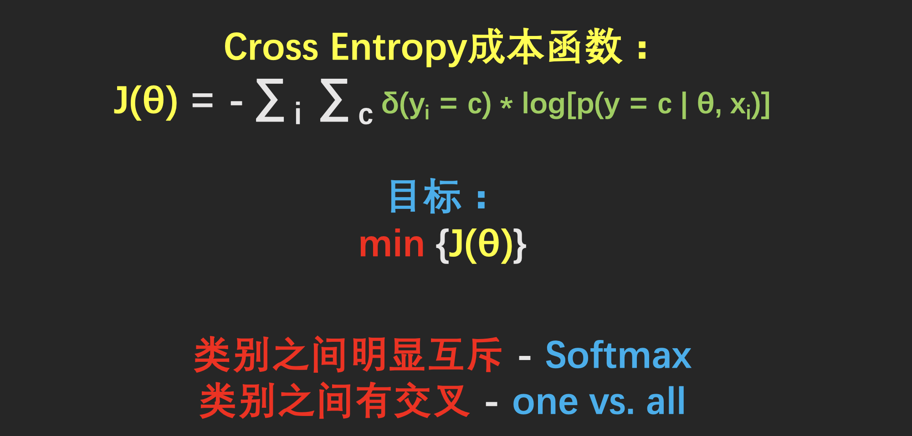

# Logistic与SVM分类

## Logistic分类

### 本质

基于统计的分类

- 结果是一个概率
- 单调可导函数

### 数学模型

为什么成本函数与线性拟合不同

Sigmoid函数的两侧几乎是平的

- 最小二乘函数的梯度在大部分情况下很小
- 收敛的很慢

## SVM分类

基于几何的分类

- 最大化分类平面与两个类型之间的距离

    优化的过程-最大化分类间距

- 模型的最优解只与边界上的数据点有关

    边界上的数据点-支持向量

### 本质

核函数是一种特征提取的手段，核函数不仅仅用于支持向量机

### 样本不均衡问题

- 构造更多的样本，是的样本数均衡

    减少多数类别的样本数，增加少数类别的样本数

- 改变分类器的边界

- 直接研究少数样本的统计特性

    - 即从研究p(y|x)到研究p(x)

### 多分类问题

- 通用方法：one vs all

    构造k(k - 1)/2个分类器

- 构造多分类的成本函数

    softmax分类器

    

