# 神经网络

## 谁来做特征提取

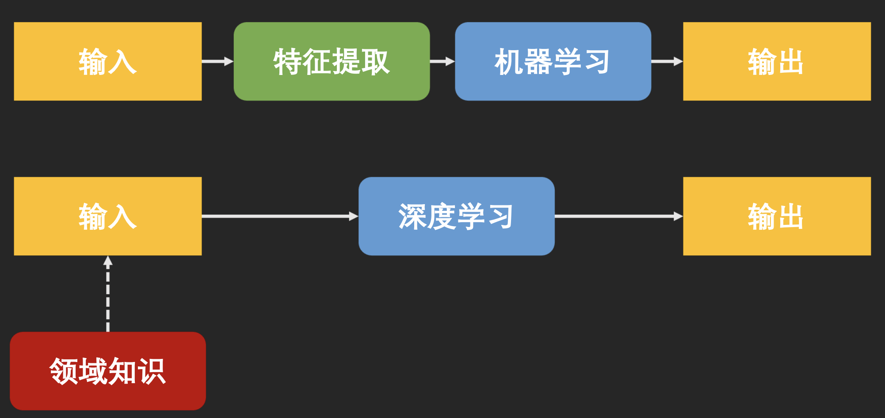

## 为什么要做深度学习

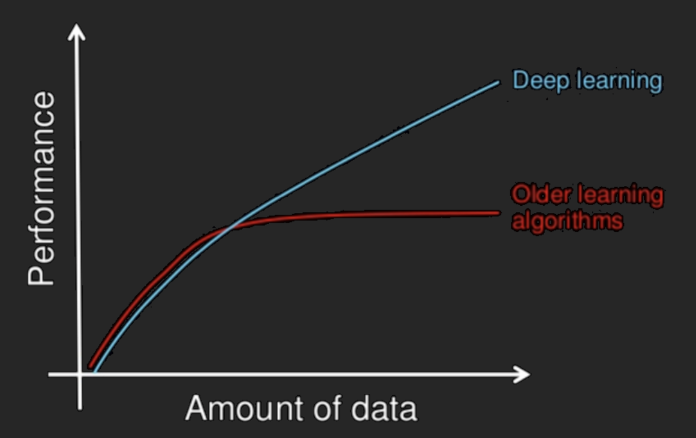

## 神经元

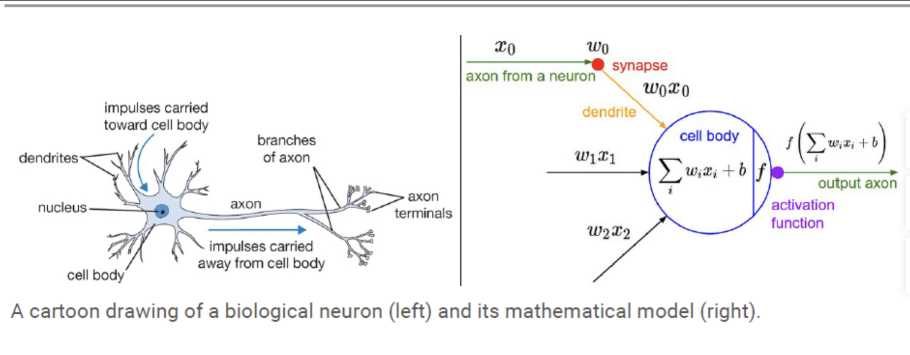

## Sigmoid和Tanh激活函数

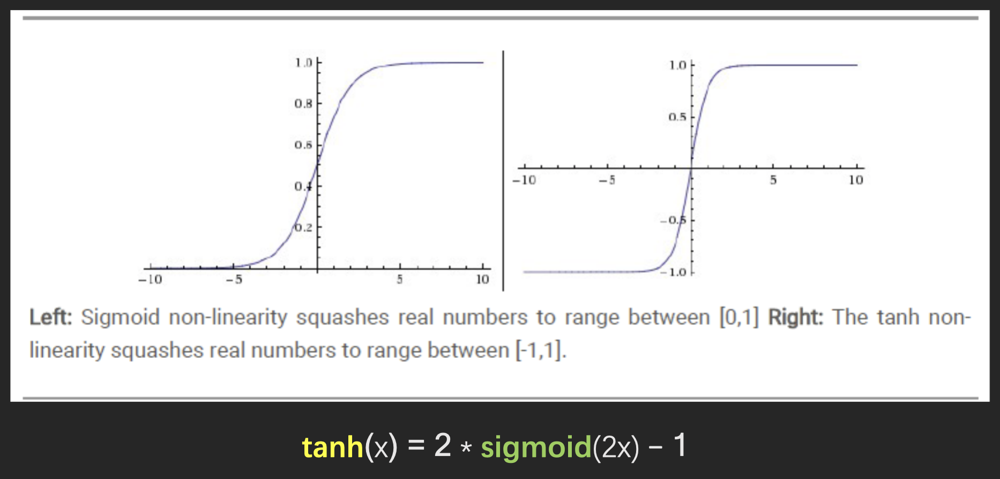

## ReLU

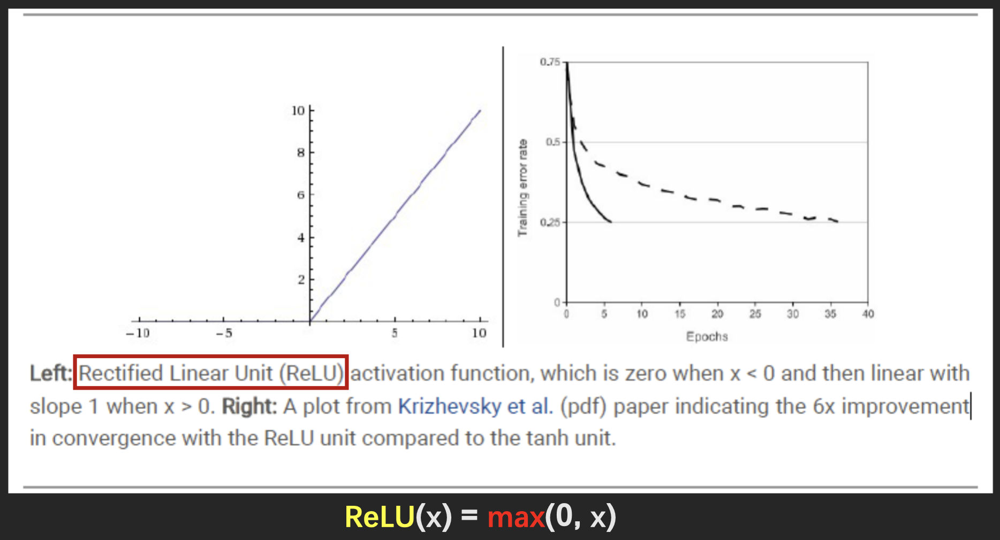

## ReLU变种

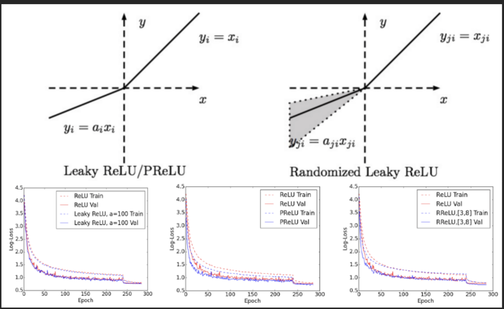

## 神经网络

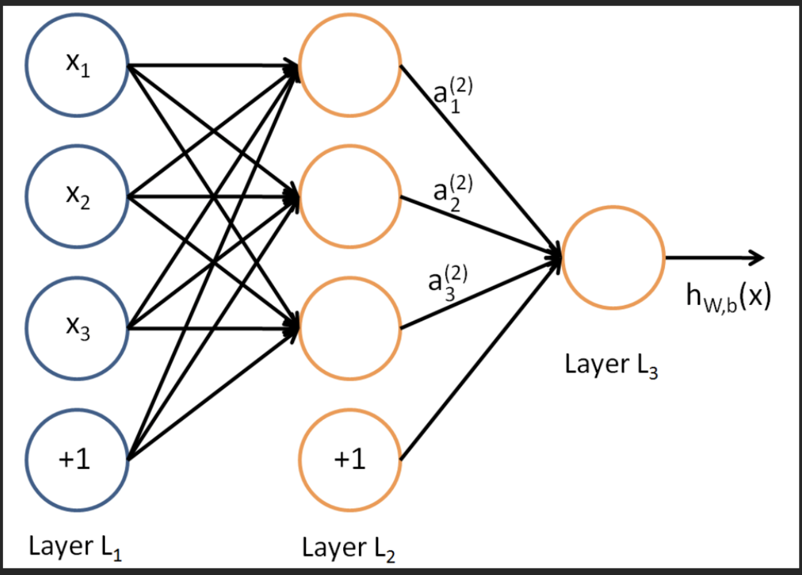

## 神经网络的数学本质

神经网络拟合的是关于输入的函数

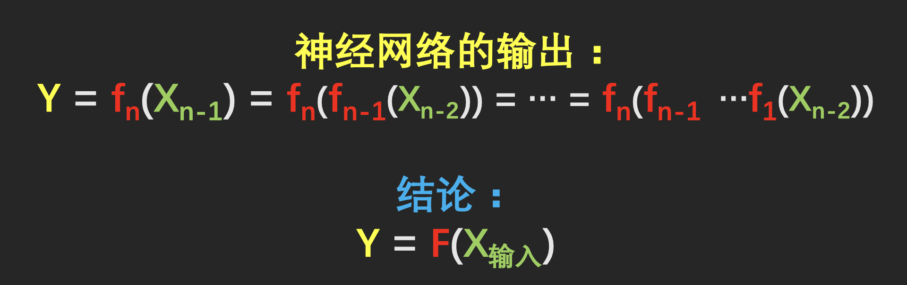

## 拟合任意函数

- 理论证明：具有一个隐藏层的神经网络可以拟合任意函数

- 深度的意义：节省指数级的神经元

    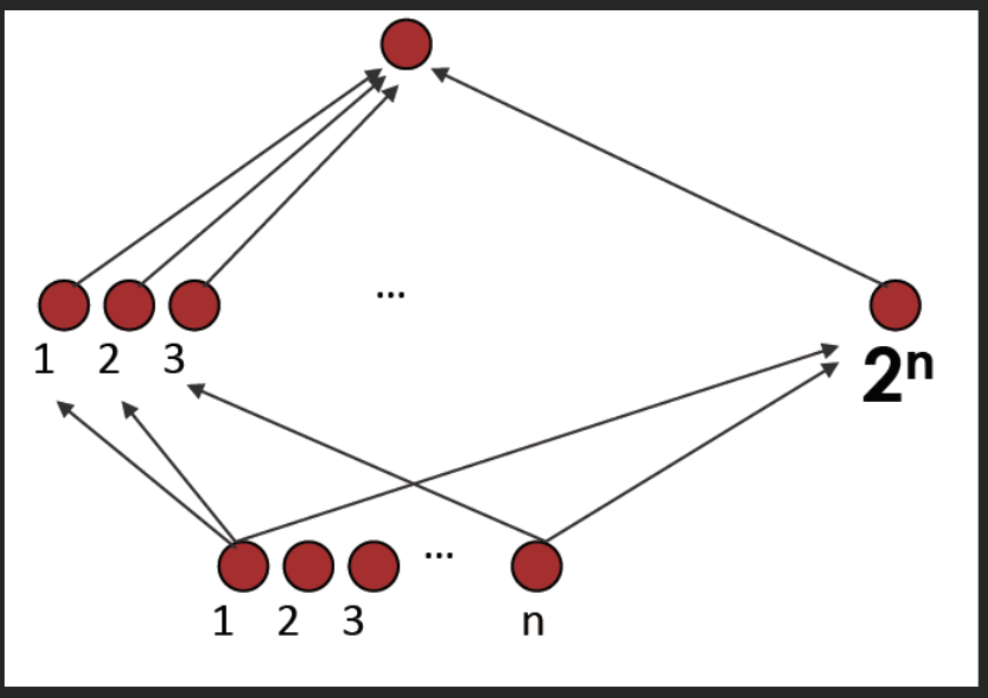

## 两个重要的神经网络

- 前馈神经网络（Feedforward Neural Network）

    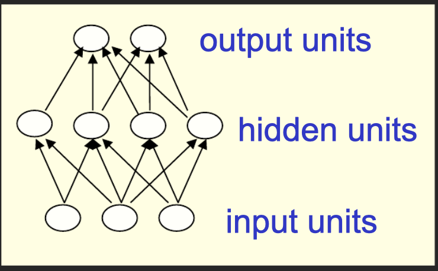

- 循环神经网络（Recurrent Neural Network）

    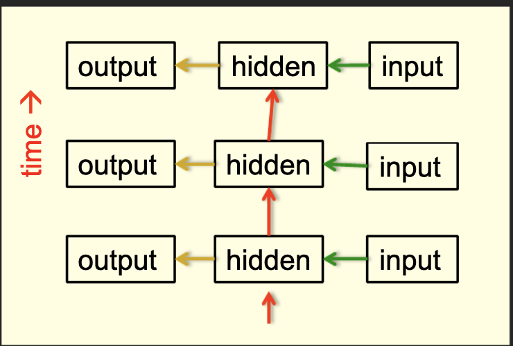