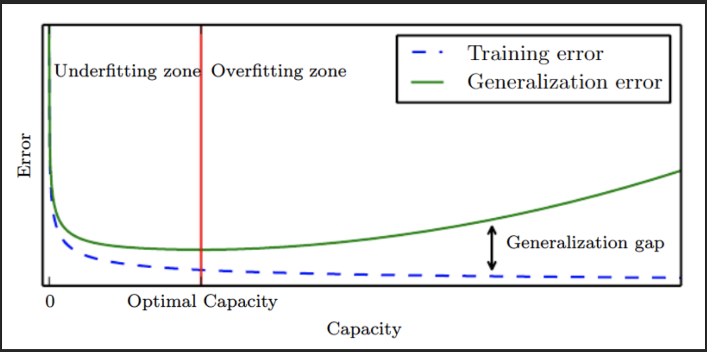
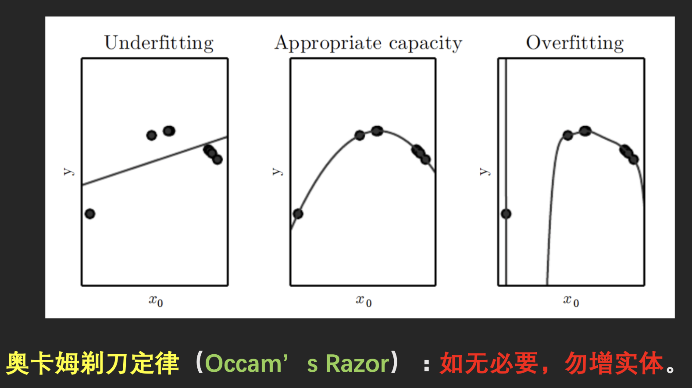
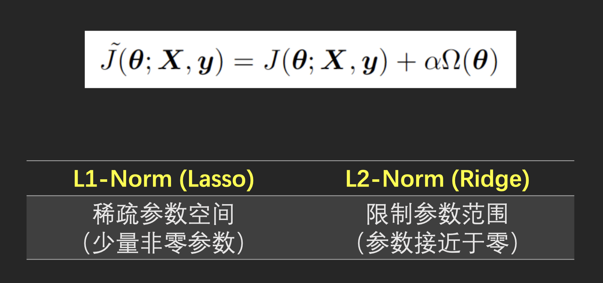
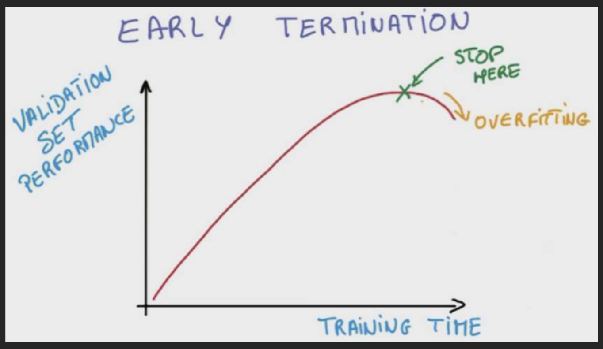
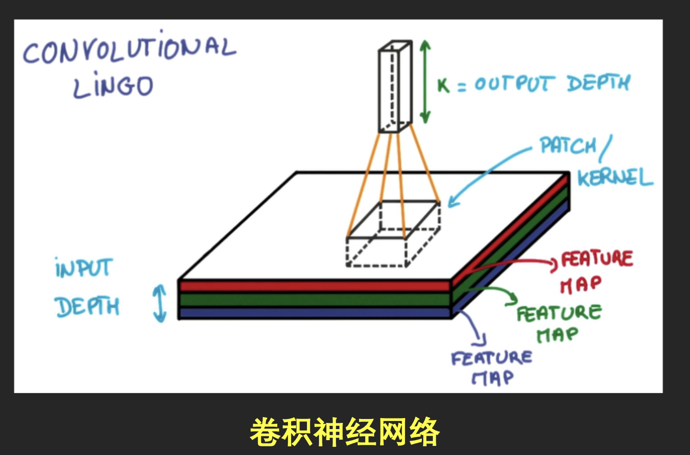
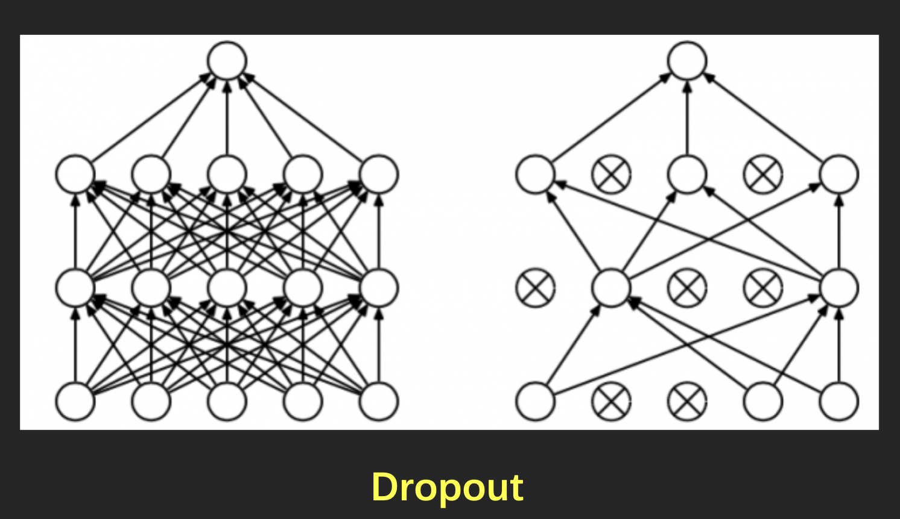
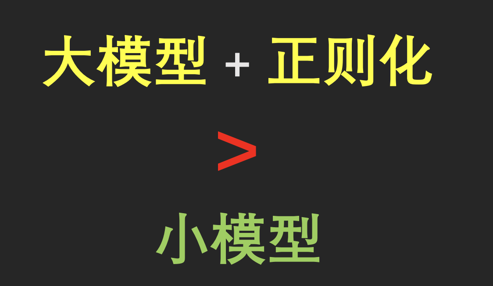

# 正则化方法

## 正则化的目的

## 模型的容量

## 正则化的方法

###  更丰富的数据

增加数据的种类

- 获取更多的训练数据
- 人工合成更多的数据
- 在训练数据中加入各种噪声

### 修改成本函数

### Early-Stoppping

### 参数共享

###  系统方法

### 其它方法

- 多任务学习
- Batch Normalization
- 非监督/半监督学习
- 生成式对抗网络

## 实战经验

