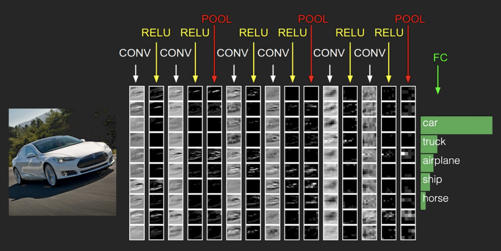
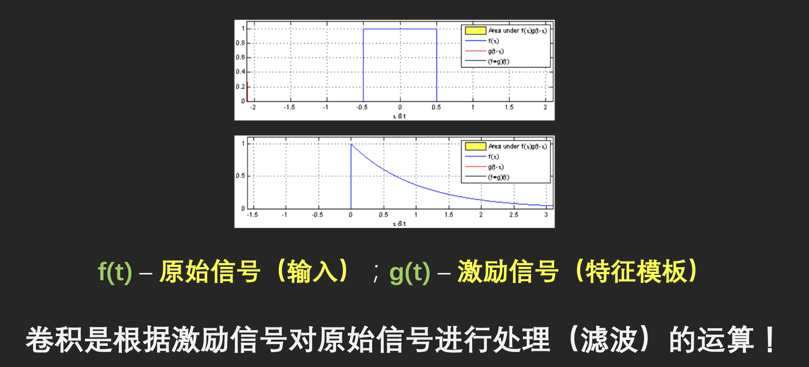
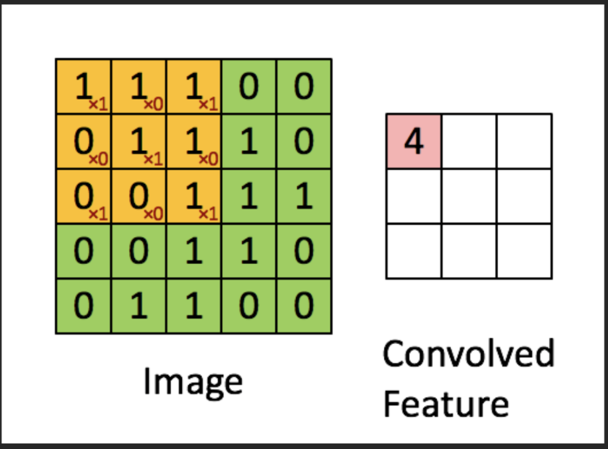
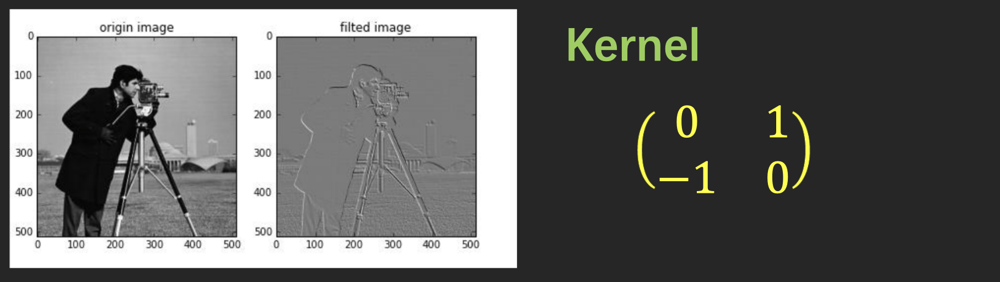
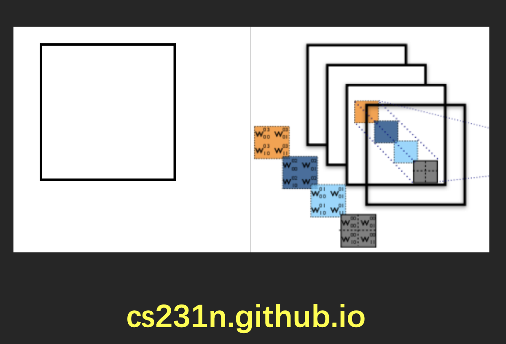
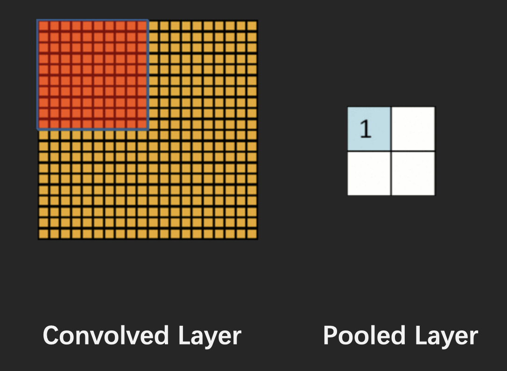
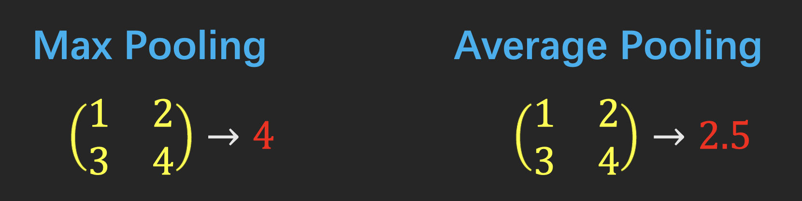
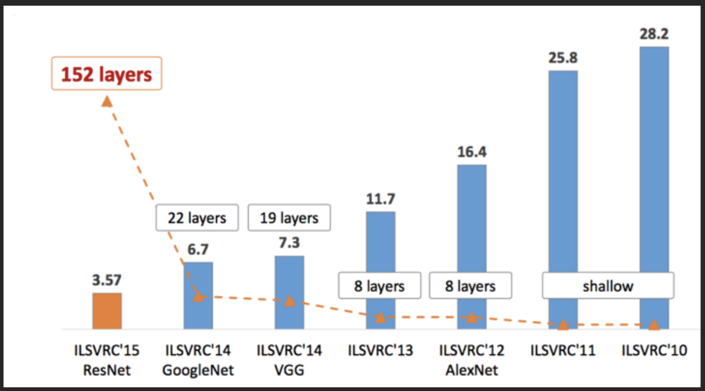
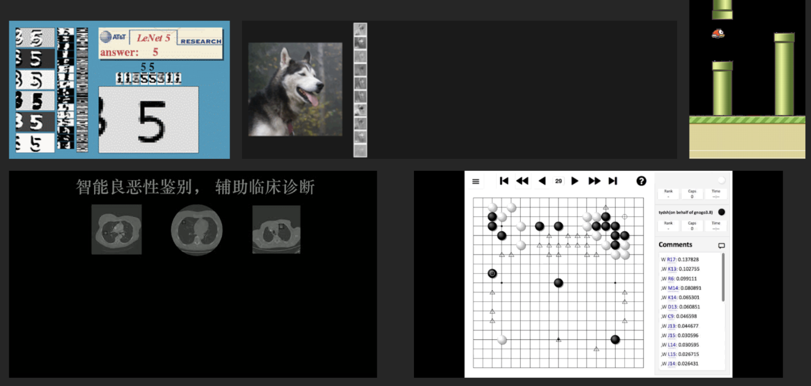

# 卷积神经网络

## 卷积神经网络

## 卷积的本质

## 图像的卷积

## CNN的本质

图像处理中的大部分滤波都是卷积操作

传统机器学习：人工构造滤波器进行图像特征提取

卷积神经网络：机器自动学习出对特定问题最有效的滤波器

## 卷积层

## 下层采样（Polling Layer）

### polling的意义

- Polling是将小邻域内的特征点整合得到新特征的过程
- Polling是能够抵抗图像中的噪声，包括平移、伸缩等
- 这里的polling无法抵抗图像旋转噪声

## 著名的CNN结构

## CNN的应用

## 真枪实弹

TensorFlow Tutorial

https://www.tensorflow.org/versions/r0.11

Tutorials/mnist/pros/index.html

