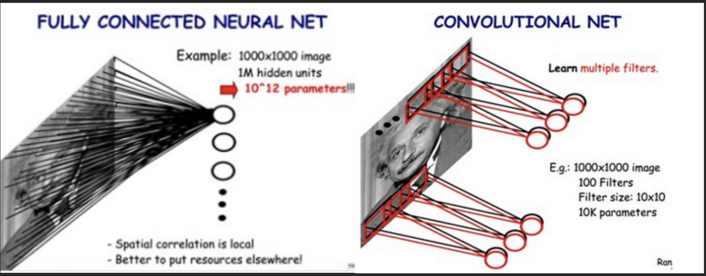
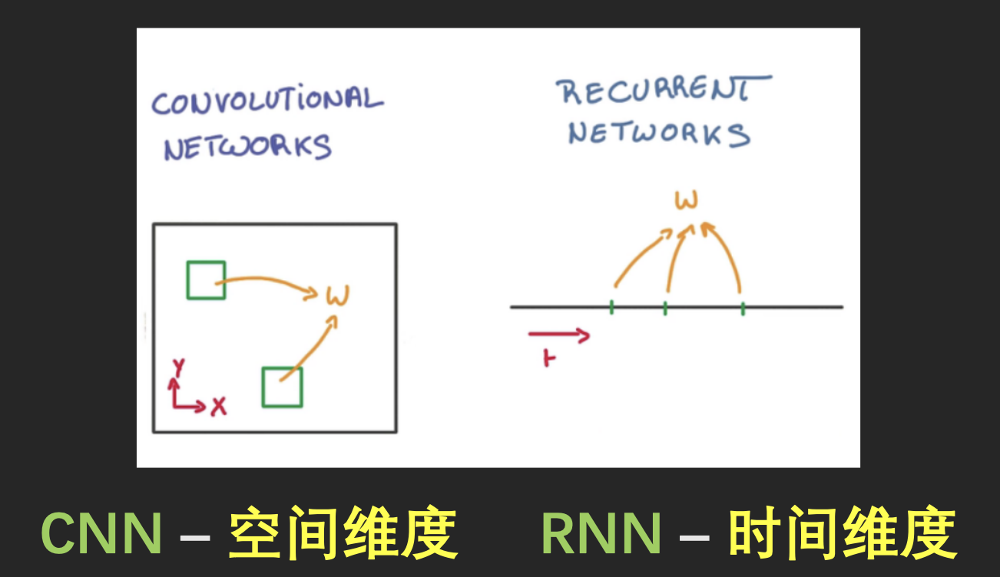
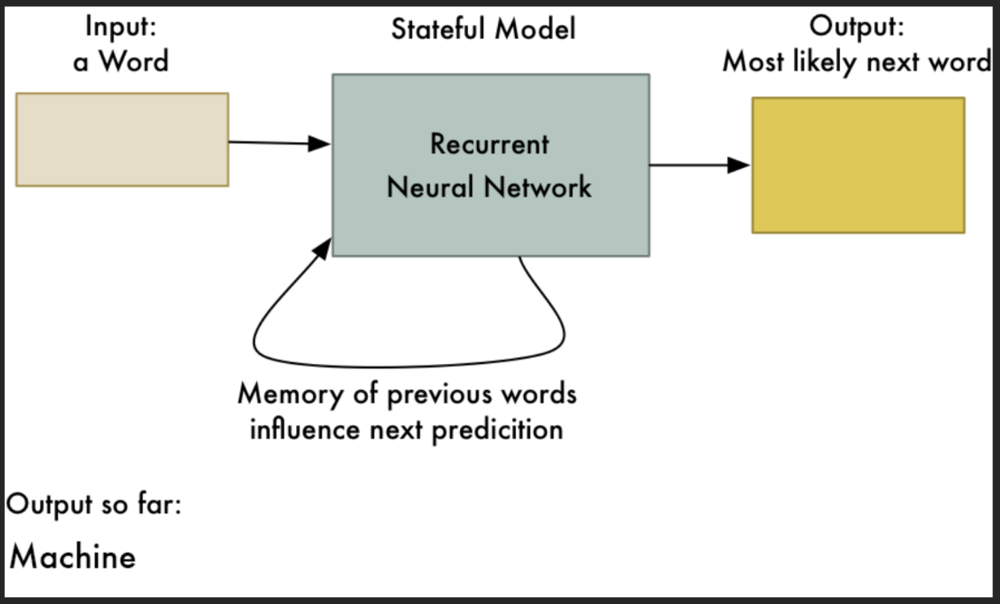
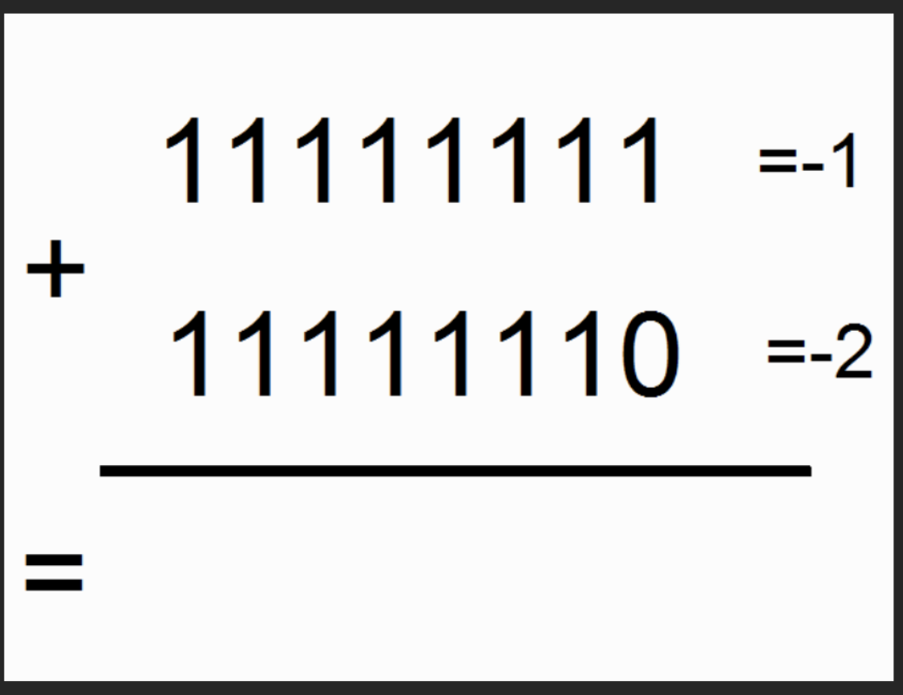
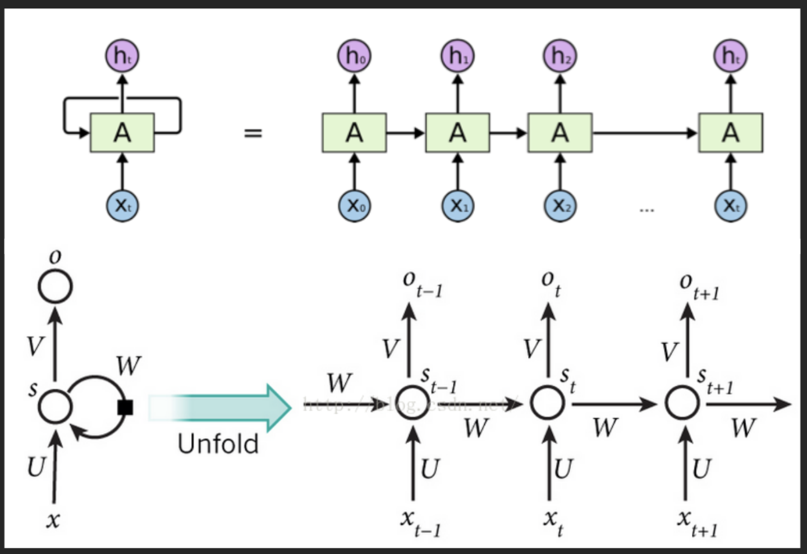
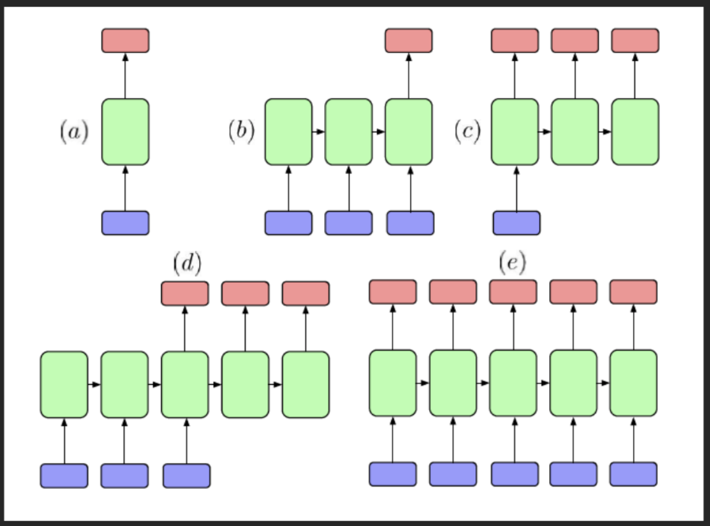
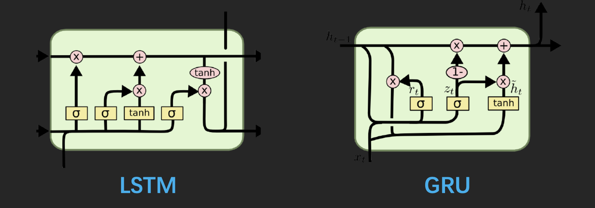
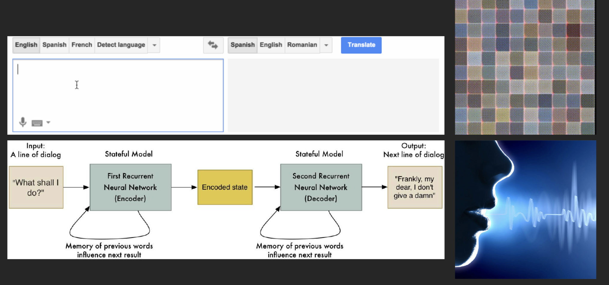
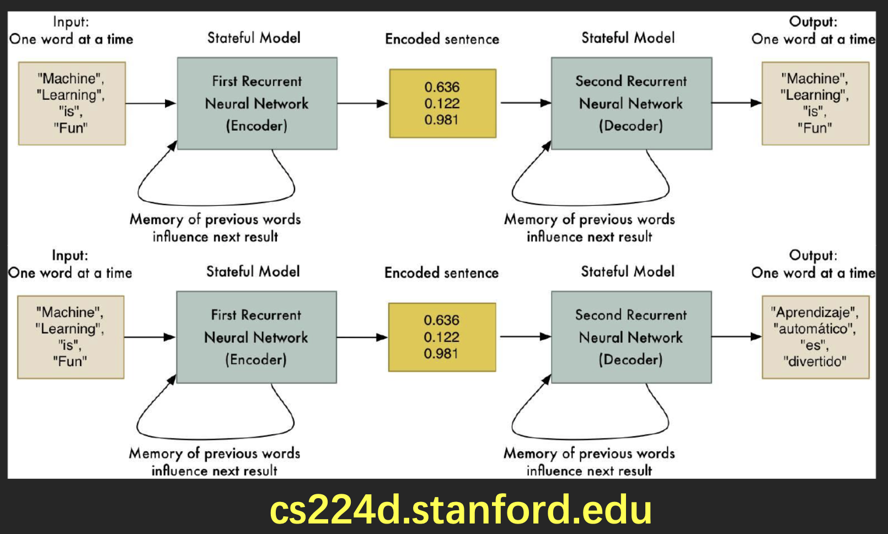

# 递归神经网络

## 参数共享

## RNN与CNN

二者都是参数共享的手段

## 递归神经网络

## 时间纬度的重要性

## RNN的结构

## 其它的RNN结构

## 隐藏层的类型

- 原始的RNN结构会出现梯度弥散和梯度爆照的问题
- 使用LSTM和GRU可以避免这个问题

## RNN的应用

## 机器翻译

## 真枪实弹

[github-alcourse](https://github.com/physicso/AICourse)