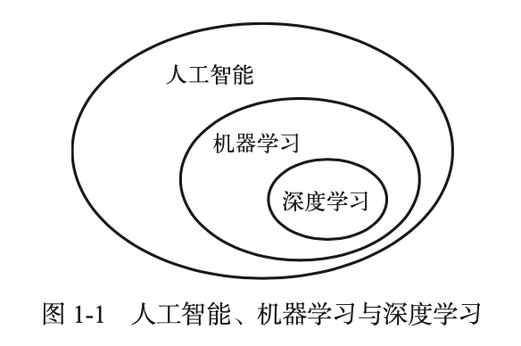
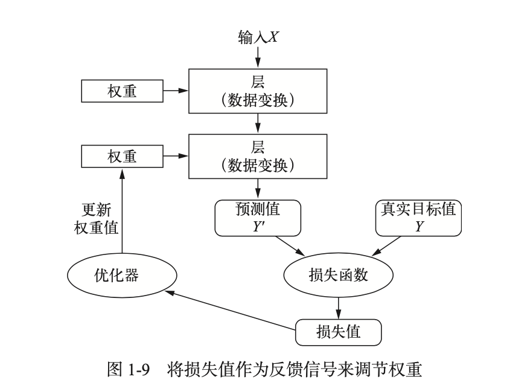
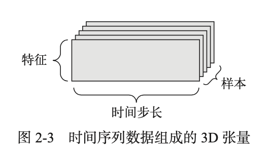
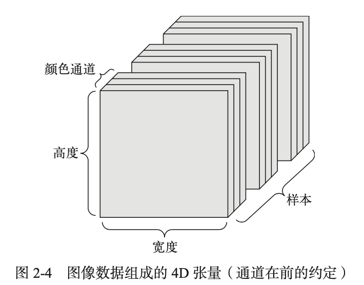
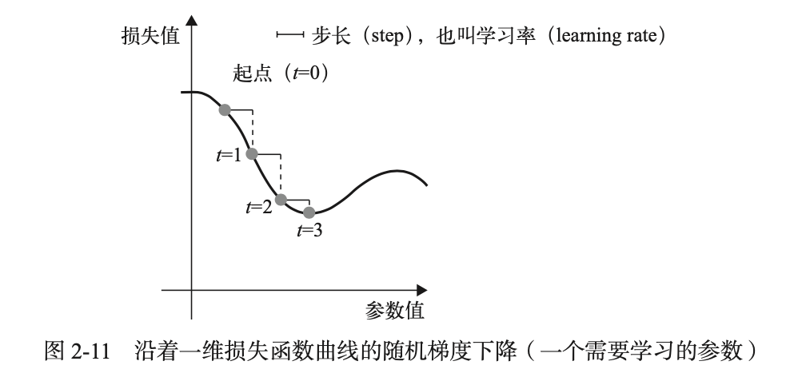

# 基础知识




## 深度学习的工作原理



## 人工智能简史

- 概率建模(probabilistic modeling)是统计学原理在数据分析中的应用。它是最早的机器学习形式之一，至今仍在广泛使用。其中最有名的算法之一就是朴素贝叶斯算法。
-  logistic 回归(logistic regression，简称 logreg)，它有时被认为是现代机器学习的“hello world”。
- 20 世纪 80 年代中期发生了变化，当时很多人都独立地重新发现了反向传播算法——一种利用梯度下降优化来训练一系列参数化运算链的方法
- 贝尔实验室于 1989 年第一次成功实现了神经网络的实践应用，当时 Yann LeCun 将卷积神经网络的早期思想与反向传播算法相结合，并将其应用于手写数字分类问题，由此得到名为 LeNet 的网络
- 很快就使人们将神经网络抛诸脑后。这种方法就是核方法(kernel method)。核方法是一组分类算法，其中最有名的就是支持向量机(SVM， support vector machine)。
- 决策树(decision tree)是类似于流程图的结构，可以对输入数据点进行分类或根据给定输入来预测输出值。决策树的可视化和解释都很简单。在 21 世纪前十年，从数据中学习得到的决策树开始引起研究人员的广泛关注。
- 特别是随机森林(random forest)算法，它引入了一种健壮且实用的决策树学习方法，即首先构建许多决策树，然后将它们的输出集成在一起。
- 直到 2014 年才被梯度提升机 所取代。与随机森林类似，梯度提升机(gradient boosting machine)也是将弱预测模型(通常是决策树)集成的机器学习技术。它使用了梯度提升方法，通过迭代地训练新模型来专门解决之前模型的弱点，从而改进任何机器学习模型的效果。
- 自 2012 年以来，深度卷积神经网络(convnet)已成为所有计算机视觉任务的首选算法。更 一般地说，它在所有感知任务上都有效。
- 深度学习从数据中进行学习时有两个基本特征:第一，通过渐进的、逐层的方式形成越来 越复杂的表示;第二，对中间这些渐进的表示共同进行学习，每一层的变化都需要同时考虑上 下两层的需要。总之，这两个特征使得深度学习比先前的机器学习方法更加成功。

## 深度学习数据

### 1.数据准备

- 训练集：模型将从这些数据中进行学习。
- 测试集：对模型进行测试。

### 2.数据表示

张量(tensor)：数据存储在多维 Numpy 数组中，张量是矩阵向任意维度的推广[注意， 张量的维度(dimension)通常叫作轴(axis)]。

- 标量(0D 张量)：仅包含一个数字的张量叫作标量(scalar，也叫标量张量、零维张量、0D 张量)。
- 向量(1D 张量)：数字组成的数组叫作向量(vector)或一维张量(1D 张量)。一维张量只有一个轴。
- 矩阵(2D 张量)：向量组成的数组叫作矩阵(matrix)或二维张量(2D 张量)。矩阵有 2 个轴(通常叫作行和 列)。你可以将矩阵直观地理解为数字组成的矩形网格。
- 3D 张量与更高维张量：将多个矩阵组合成一个新的数组，可以得到一个 3D 张量，你可以将其直观地理解为数字 组成的立方体。将多个 3D 张量组合成一个数组，可以创建一个 4D 张量，以此类推。深度学习处理的一般 是 0D 到 4D 的张量，但处理视频数据时可能会遇到 5D 张量。

张量属性

- 轴的个数(阶)。例如，3D 张量有 3 个轴，矩阵有 2 个轴。
- 形状(shape)。这是一个整数元组，表示张量沿每个轴的维度大小(元素个数)。
- 数据类型(在 Python 库中通常叫作 dtype)。

操作张量

- 选择张量的特定元素叫作张量切片(tensor slicing)。

数据批量

- 深度学习中所有数据张量的第一个轴(0 轴，因为索引从 0 开始)都是样本轴 **3** (samples axis，有时也叫样本维度)。
- 批量张量，第一个轴(0 轴)叫作批量轴(batch axis)或批量维度(batch dimension)。

现实世界中的数据张量

- 向量数据:2D 张量，形状为 (samples, features)。(即向量组成的数组)，其中第一个轴是样本轴，第二个轴是特征轴。

- 时间序列数据或序列数据:3D 张量，形状为 (samples, timesteps, features)。当时间(或序列顺序)对于数据很重要时，应该将数据存储在带有时间轴的 3D 张量中。

    

- 图像:4D 张量，形状为 (samples, height, width, channels) 或 (samples, channels, height, width)。

    

- 视频:5D 张量，形状为 (samples, frames, height, width, channels) 或 (samples, frames, channels, height, width)。视频数据是现实生活中需要用到 5D 张量的少数数据类型之一。视频可以看作一系列帧， **6** 每一帧都是一张彩色图像。

### 3.张量运算

- 逐元素运算

    - relu 运算和加法都是逐元素(element-wise)的运算，即该运算独立地应用于张量中的每 个元素，也就是说，这些运算非常适合大规模并行实现(向量化实现，这一术语来自于 1970— 1990 年间向量处理器超级计算机架构)。

    - ```python
        def naive_relu(x):
        		assert len(x.shape) == 2 # x 是一个 Numpy 的 2D 张量
        		x = x.copy() # 避免覆盖输入张量 
            for i in range(x.shape[0]):
              	for j in range(x.shape[1]): 
               			x[i, j] = max(x[i, j], 0)
           	return x
        #对于加法采用同样的实现方法。
        def naive_add(x, y):
        		assert len(x.shape) == 2 
            assert x.shape == y.shape
        		x = x.copy()
        		for i in range(x.shape[0]):
        				for j in range(x.shape[1]): 
                  	x[i, j] += y[i, j]
        		return x
        ```

- 广播运算

    - 较小的张量会被广播(broadcast)，以匹配较大张量的形状。广播包含 **4** 以下两步。

        (1) 向较小的张量添加轴(叫作广播轴)，使其ndim与较大的张量相同。
        (2) 将较小的张量沿着新轴重复，使其形状与较大的张量相同。

        ```python
        def naive_add_matrix_and_vector(x, y):
        	assert len(x.shape) == 2 
            assert len(y.shape) == 1 
            assert x.shape[1] == y.shape[0]
        	x = x.copy()
        	for i in range(x.shape[0]):
        		for j in range(x.shape[1]): 
                    x[i, j] += y[j]
        	return x
        ```

- 张量点积

    - 点积运算，也叫张量积(tensor product，不要与逐元素的乘积弄混)，是最常见也最有用的 张量运算。与逐元素的运算不同，它将输入张量的元素合并在一起。其实就是矩阵乘法

        ```python
        import numpy as np 
        z = np.dot(x, y)
        ```

- 张量变形

    - 张量变形是指改变张量的行和列，以得到想要的形状。变形后的张量的元素总个数与初始 张量相同。简单的例子可以帮助我们理解张量变形。

        ```python
        >>> x = np.array([[0., 1.], [2., 3.],
        [4., 5.]]) >>> print(x.shape)
        (3, 2)
        >>> x = x.reshape((6, 1)) >>> x
        array([[ 0.],
                   [ 1.],
                   [ 2.],
                   [ 3.],
                   [ 4.],
                   [ 5.]])
        >>> x = x.reshape((2, 3)) >>> x
        array([[ 0., 1., 2.],
        [ 3., 4., 5.]])
        ```

    - 经常遇到的一种特殊的张量变形是转置(transposition)。对矩阵做转置是指将行和列互换， 使 x[i, :] 变为 x[:, i]。

        ```python
        >>> x = np.zeros((300, 20)) 
        >>> x = np.transpose(x) 
        >>> print(x.shape)
        (20, 300)
        ```

- 张量运算的几何解释：向量运算，坐标系运算

### 4.张量优化

- 梯度优化

    - 在一个训练循环(training loop)内，其具体过程如下。必要时一直重复这些 步骤。

        (1) 抽取训练样本x和对应目标y组成的数据批量。
        (2) 在 x 上运行网络[这一步叫作前向传播(forward pass)]，得到预测值 y_pred。
        (3) 计算网络在这批数据上的损失，用于衡量y_pred和y之间的距离。
        (4) 更新网络的所有权重，使网络在这批数据上的损失略微下降。

    - 张量运算的导数:梯度

        - 梯度(gradient)是张量运算的导数。它是导数这一概念向多元函数导数的推广。多元函数 是以张量作为输入的函数。

        - 梯度下降

            - (1)  抽取训练样本x和对应目标y组成的数据批量。

            - (2)  在x上运行网络，得到预测值y_pred。

            - (3)  计算网络在这批数据上的损失，用于衡量y_pred和y之间的距离。

            - (4)  计算损失相对于网络参数的梯度[一次反向传播(backward pass)]。

            - (5)  将参数沿着梯度的反方向移动一点，比如 W -= step * gradient，从而使这批数据上的损失减小一点。

                

    - 链式求导:反向传播算法

        - f(W1, W2, W3) = a(W1, b(W2, c(W3))) 根据微积分的知识，这种函数链可以利用下面这个恒等式进行求导，它称为链式法则(chain rule):(f(g(x)))' = f'(g(x)) * g'(x)。将链式法则应用于神经网络梯度值的计算，得 到的算法叫作反向传(backpropagation，有时也叫反式微分，reverse-mode differentiation)。反 向传播从最终损失值开始，从最顶层反向作用至最底层，利用链式法则计算每个参数对损失值 的贡献大小。

## 神经网络剖析

### 基础组件

训练神经网络主要围绕以下四个方面。 ‰ 

- 层，多个层组合成网络(或模型)。
- 输入数据和相应的目标。
- 损失函数，即用于学习的反馈信号。‰
- 优化器，决定学习过程如何进行。

### 1.层: 深度学习的基础组件

神经网络的基本数据结构是层。层是一个数据处理模块，将一个或多个输入张量转换为一个或多个输出张量。有些层是无状态的，但大多数的层是有状态的， 即层的权重。权重是利用随机梯度下降学到的一个或多个张量，其中包含网络的知识。

- 简单的向量数据保存在 形状为 (samples, features) 的 2D 张量中，通常用密集连接层[densely connected layer，也叫全连接层(fully connected layer)或密集层(dense layer)，对应于 Keras 的 Dense 类]来处理。
- 序列数据保存在形状为 (samples, timesteps, features) 的 3D 张量中，通常用循环层(recurrent layer，比如 Keras 的 LSTM 层)来处理。
- 图像数据保存在 4D 张量中，通常用二维卷积层(Keras 的 Conv2D)来处理。

### 2.模型: 层构成的网络

深度学习模型是层构成的有向无环图。最常见的例子就是层的线性堆叠，将单一输入映射 为单一输出。但随着深入学习，你会接触到更多类型的网络拓扑结构。一些常见的网络拓扑结构如下。 ‰ 

- 双分支(two-branch)网络
- 多头(multihead)网络
- Inception 模块

### 3.损失函数与优化器: 配置学习过程的关键

一旦确定了网络架构，你还需要选择以下两个参数。

- 损失函数(目标函数)——在训练过程中需要将其最小化。它能够衡量当前任务是否已成功完成。
- 优化器——决定如何基于损失函数对网络进行更新。它执行的是随机梯度下降(SGD)的某个变体
    - 对于二分类问题，可以使用二元交叉熵(binary crossentropy)损失函数
    - 对于多分类问题，可以用分类交叉熵(categorical crossentropy)损失函数
    - 对于回归问题，可以用均方误差(mean-squared error)损失函数
    - 对于序列学习问题，可以用联结主义时序分类(CTC，connectionist temporal classification)损失函数，等等

## 机器学习基础

### 1.监督学习

监督学习是目前最常见的机器学习类型。给定一组样本(通常由人工标注)，它可以学会将 输入数据映射到已知目标[也叫标注(annotation)]。例如二分类问题、多分类问题和标量回归问题

虽然监督学习主要包括分类和回归，但还有更多的奇特变体，主要包括如下几种

- 序列生成(sequence generation)。给定一张图像，预测描述图像的文字。序列生成有时可以被重新表示为一系列分类问题，比如反复预测序列中的单词或标记。
- 语法树预测(syntax tree prediction)。给定一个句子，预测其分解生成的语法树。
- 目标检测(object detection)。给定一张图像，在图中特定目标的周围画一个边界框。这个问题也可以表示为分类问题(给定多个候选边界框，对每个框内的目标进行分类)或分类与回归联合问题(用向量回归来预测边界框的坐标)。
- 图像分割(image segmentation)。给定一张图像，在特定物体上画一个像素级的掩模(mask)

### 2.无监督学习

无监督学习是指在没有目标的情况下寻找输入数据的有趣变换，其目的在于数据可视化、 数据压缩、数据去噪或更好地理解数据中的相关性。无监督学习是数据分析的必备技能，在解决监督学习问题之前，为了更好地了解数据集，它通常是一个必要步骤。降维(dimensionality reduction)和聚类(clustering)都是众所周知的无监督学习方法。

### 3.自监督学习

自监督学习是监督学习的一个特例，它与众不同，值得单独归为一类。自监督学习是没有人工标注的标签的监督学习，你可以将它看作没有人类参与的监督学习。标签仍然存在(因为 总要有什么东西来监督学习过程)，但它们是从输入数据中生成的，通常是使用启发式算法生 成的。

- 自编码器(autoencoder)是有名的自监督学习的例子，其生成的目标就是未经 修改的输入。《时序监督学习》

### 4.强化学习

强化学习一直以来被人们所忽视，但最近随着 Google 的 DeepMind 公司将其成功应用于学 习玩 Atari 游戏(以及后来学习下围棋并达到最高水平)，机器学习的这一分支开始受到大量关注。 在强化学习中，智能体(agent)接收有关其环境的信息，并学会选择使某种奖励最大化的行动。

## 模型评估

选择模型评估方法时，需要注意以下几点。

- ‰数据代表性(data representativeness)。你希望训练集和测试集都能够代表当前数据。例如，你想要对数字图像进行分类，而图像样本是按类别排序的，如果你将前 80% 作为训 练集，剩余 20% 作为测试集，那么会导致训练集中只包含类别 0~7，而测试集中只包含 类别 8~9。这个错误看起来很可笑，却很常见。因此，在将数据划分为训练集和测试集 之前，通常应该随机打乱数据。
- 时间箭头(the arrow of time)。如果想要根据过去预测未来(比如明天的天气、股票走势 等)，那么在划分数据前你不应该随机打乱数据，因为这么做会造成时间泄露(temporal leak):你的模型将在未来数据上得到有效训练。在这种情况下，你应该始终确保测试集 中所有数据的时间都晚于训练集数据。
- ‰数据冗余(redundancy in your data)。如果数据中的某些数据点出现了两次(这在现实中 的数据里十分常见)，那么打乱数据并划分成训练集和验证集会导致训练集和验证集之 间的数据冗余。从效果上来看，你是在部分训练数据上评估模型，这是极其糟糕的!一 定要确保训练集和验证集之间没有交集。

## 数据预处理

数据预处理的目的是使原始数据更适于用神经网络处理，包括向量化、标准化、处理缺失值和特征提取

### 1.向量化

神经网络的所有输入和目标都必须是浮点数张量(在特定情况下可以是整数张量)。无论 处理什么数据(声音、图像还是文本)，都必须首先将其转换为张量，这一步叫作数据向量化 (data vectorization)。

### 2.值标准化

在手写数字分类的例子中，开始时图像数据被编码为 0~255 范围内的整数，表示灰度值。 将这一数据输入网络之前，你需要将其转换为 float32 格式并除以 255，这样就得到 0~1范围内的浮点数。

### 3.处理缺失值

一般来说，对于神经网络，将缺失值设置为 0 是安全的，只要 0 不是一个有意义的值。网 络能够从数据中学到 0 意味着缺失数据，并且会忽略这个值。

## 过拟合与欠拟合

机器学习的根本问题是优化和泛化之间的对立

- 优化(optimization)是指调节模型以在训练数据上得到最佳性能(即机器学习中的学习)
- 泛化(generalization)是指训练好的模型在 前所未见的数据上的性能好坏。

训练开始时，优化和泛化是相关的:训练数据上的损失越小，测试数据上的损失也越小。 这时的模型是欠拟合(underfit)的

为了防止模型从训练数据中学到错误或无关紧要的模式，最优解决方法是获取更多的训练 数据。模型的训练数据越多，泛化能力自然也越好

- 添加 dropout 正则化

    dropout 是神经网络最有效也最常用的正则化方法之一，它是由多伦多大学的 Geoffrey Hinton 和他的学生开发的。对某一层使用 dropout，就是在训练过程中随机将该层的一些输出特征舍 弃(设置为 0)。

## 机器学习的通用流程

### 1.定义问题，收集数据集

首先，你必须定义所面对的问题。

### 2.选择衡量成功的指标

要控制一件事物，就需要能够观察它。

### 3.确定评估方法

一旦明确了目标，你必须确定如何衡量当前的进展。前面介绍了三种常见的评估方法。

- ‰  留出验证集。数据量很大时可以采用这种方法。
- ‰  *K* 折交叉验证。如果留出验证的样本量太少，无法保证可靠性，那么应该选择这种方法。
- ‰  重复的 *K* 折验证。如果可用的数据很少，同时模型评估又需要非常准确，那么应该使用这种方法。

只需选择三者之一。大多数情况下，第一种方法足以满足要求。

### 4.准备数据

一旦知道了要训练什么、要优化什么以及评估方法，那么你就几乎已经准备好训练模型了。 但首先你应该将数据格式化，使其可以输入到机器学习模型中(这里假设模型为深度神经网络)。

- ‰ 如前所述，应该将数据格式化为张量。
- 这些张量的取值通常应该缩放为较小的值，比如在 [-1, 1] 区间或 [0, 1] 区间。 ‰ 
- 如果不同的特征具有不同的取值范围(异质数据)，那么应该做数据标准化。 ‰ 
- 你可能需要做特征工程，尤其是对于小数据问题。 
- 准备好输入数据和目标数据的张量后，你就可以开始训练模型了。

### 5.开发比基准更好的模型

这一阶段的目标是获得统计功效(statistical power)，即开发一个小型模型，它能够打败纯 随机的基准(dumb baseline)。

### 6.扩大模型规模:开发过拟合的模型

### 7.模型正则化与调节超参数

