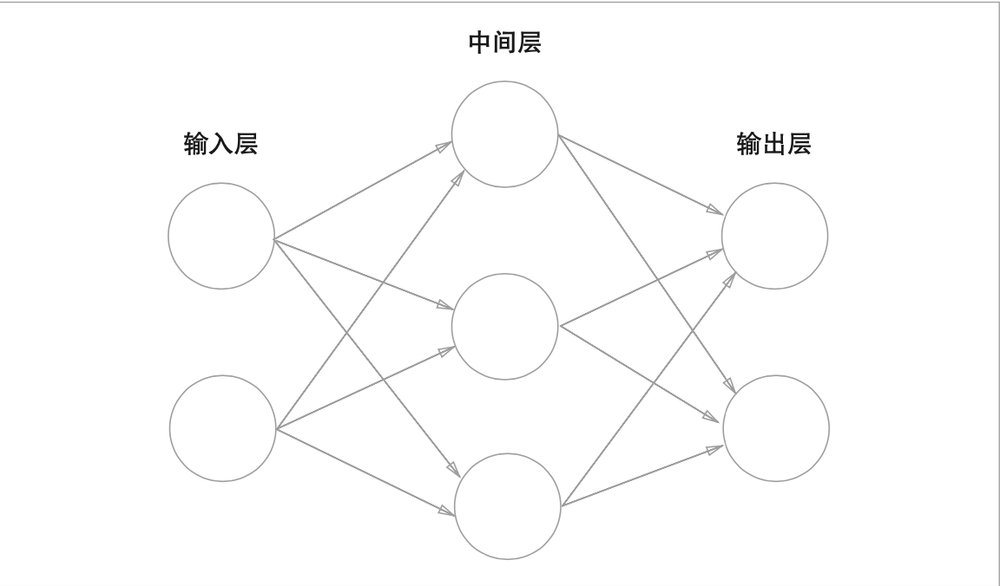
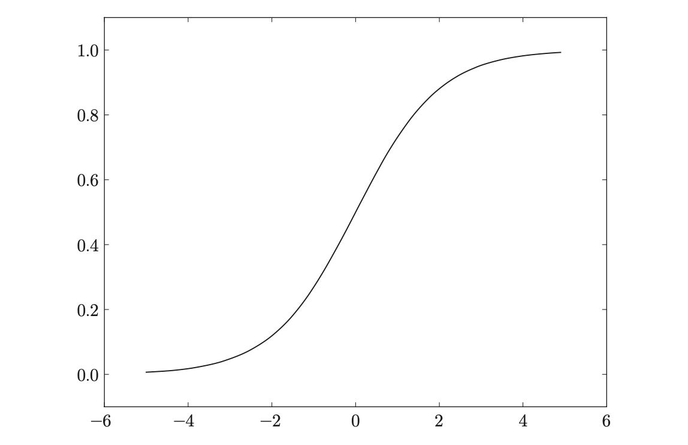
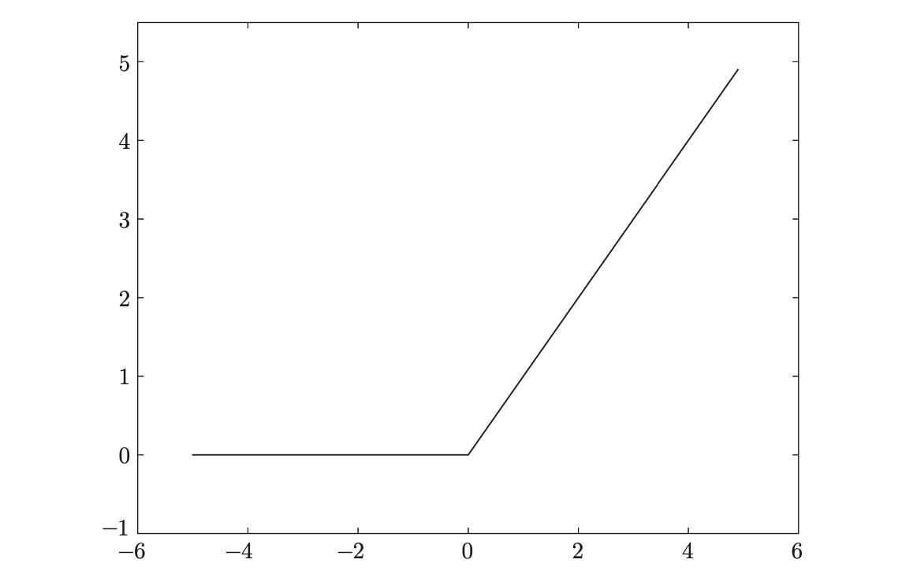

# 基本概念

## 感知机

感知机是具有输入和输出的算法。给定一个输入后，将输出一个既定的值。思想来源于逻辑电路的与、或、非门电路

$$
y = 
\begin{bmatrix}
0 \quad(\omega_{1}x_{1}+\omega_{2}x_{1}≤\theta)\\
1 \quad(\omega_{1}x_{1}+\omega_{2}x_{1}>\theta)\\
\end{bmatrix}
$$

### 单层感知机

- 异或门无法通过单层感知机来表示
- 单层感知机只能表示线性空间

### 多层感知机

- 2层感知机可以表示异或门
- 多层感知机可以表示非线性空间

## 神经网络组成

### 图表示

### 激活函数

激活函数的 作用在于决定如何来激活输入信号的总和

#### Sigmoid

$$
h(x)=\frac{1}{1+exp(-x)}
$$

#### ReLU

ReLU 函数在输入大于 0 时，直接输出该值;在输入小于等于 0 时，输 出 0 
$$
h(x)=
\begin{bmatrix}
x \quad(x > 0)\\
0 \quad(x ≤ 0)\\
\end{bmatrix}
$$

### 正则化

#### Softmax

softmax 函数会将输入值正规化之后再输出

#### Dropout

Dropout 是一种在学习的过程中随机删除神经元的方法

## 神经网络学习

### 数据

为了正确评价模型的泛化能 力，就必须划分训练数据和测试数据。另外，训练数据也可以称为监督数据

#### 训练数据

使用训练数据进行学习，寻找最优的参数

#### 测试数据

使用测试 数据评价训练得到的模型的实际能力

### 损失函数

神经网络的学习中 所用的指标称为损失函数(loss function)。这个损失函数可以使用任意函数， 但一般用均方误差和交叉熵误差等

#### 均方误差

$$
E=\frac{1}{2}\sum_{k}(y_{k}-t_{k})^2
$$

这里，yk 是表示神经网络的输出，tk 表示监督数据，k 表示数据的维数

#### 交叉熵误差

$$
E=-\sum_{k}t_{k}\log{y_{k}}
$$

这里，log 表示以 e 为底数的自然对数(log e)。yk 是神经网络的输出，tk 是 正 确 解 标 签 。 并 且 ， t k 中 只 有 正 确 解 标 签 的 索 引 为 1

#### mini-batch

如果训练数据 有 100 个的话，我们就要把这 100 个损失函数的总和作为学习的指标
$$
E=-\frac{1}{N}\sum_{n}\sum_{k}t_{nk}\log{y_{nk}}
$$

#### 总结

在进行神经网络的学习时，不能将识别精度作为指标。因为如果以 识别精度为指标，则参数的导数在绝大多数地方都会变为 0

### 梯度

由全部变量的偏导数汇总 而成的向量称为梯度(gradient)

#### 梯度法

- 寻找最小值的梯度法称为梯度下降法(gradient descent method)
- 寻找最大值的梯度法称为梯度上升法(gradient ascent method)

用数学式来表示梯度法
$$
x_{0}=x_{0}-\eta\frac{\partial{f}}{\partial{x_{0}}}\\
x_{1}=x_{1}-\eta\frac{\partial{f}}{\partial{x_{1}}}
$$

#### 随机梯度下降(SGD)

通过梯度下降法更新 参数，不过因为这里使用的数据是随机选择的mini batch数据，所以又称为随机梯度下降法(stochastic gradient descent)。“随机”指的是“随机选择的” 的意思，因此，随机梯度下降法是“对随机选择的数据进行的梯度下降法”。
$$
W<-W-\eta\frac{\partial{L}}{\partial{W}}
$$

##### 缺点

虽然 SGD 简单，并且容易实现，但是在解决某些问题时可能没有效率

除了SGD之外，还有Momentum、AdaGrad、 Adam 等方法。

### 学习算法的实现

- 前提

神经网络中有合适的权重和偏置，调整权重和偏置以便拟合训练数据的 过程称为学习。神经网络的学习分为下面 4 个步骤

- 步骤 1(mini-batch) 

从训练数据中随机选择一部分数据

- 步骤 2(计算梯度)

计算损失函数关于各个权重参数的梯度

- 步骤 3(更新参数) 

将权重参数沿梯度方向进行微小的更新

- 步骤 4(重复)

重复步骤 1、步骤 2、步骤 3。